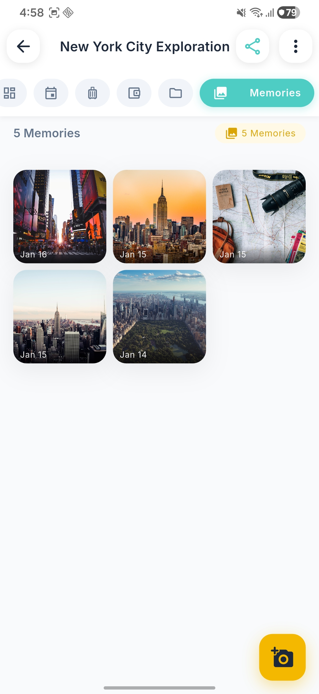
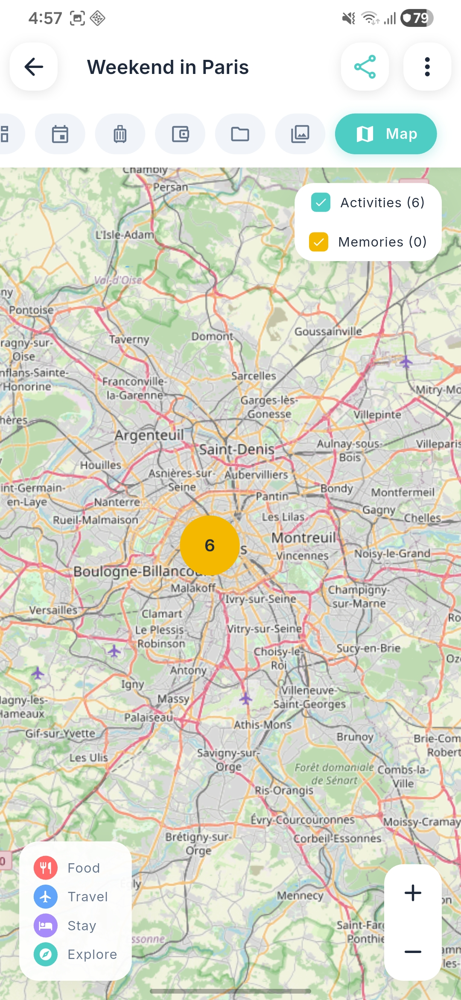
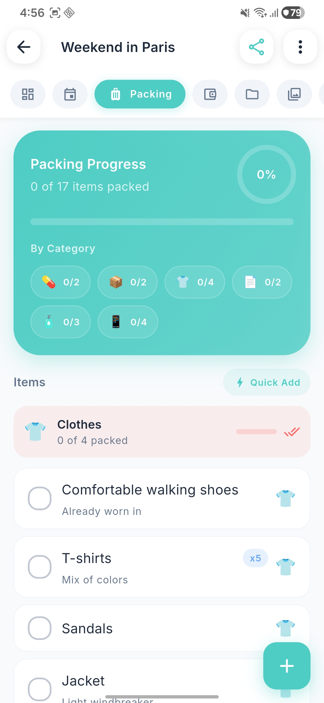
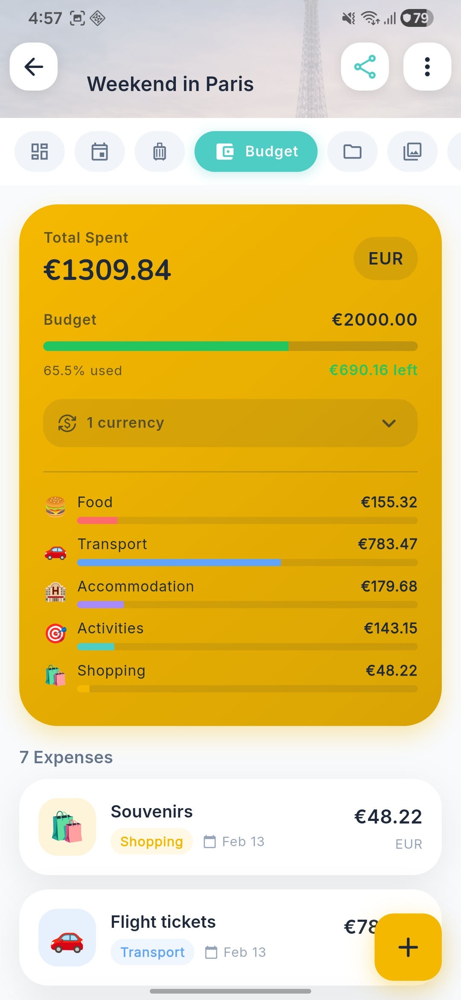
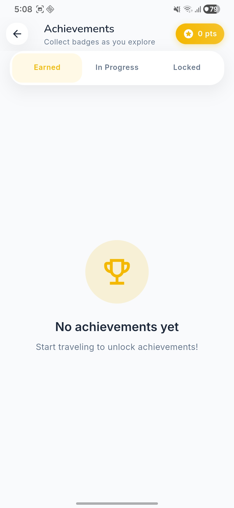

# Odyssey - Travel Journal App

A beautiful, cinematic travel journal mobile app built with Flutter. Plan trips, track activities, and capture memories with photo locations on a map.


## Features

- **Authentication** - Secure JWT-based login and registration
- **Trip Management** - Create, edit, and delete trips with cover images
- **Activities** - Plan and track activities with scheduling, categories, and location mapping
- **Memories** - Capture photos with location data, view on interactive map
- **Packing Lists** - Organize items by category with quantity tracking
- **Budget Tracking** - Multi-currency expense tracking with automatic conversion
- **Documents** - Store and manage travel documents (PDFs, tickets, reservations)
- **Achievements** - Gamification system with badges, points, and leaderboard
- **Statistics** - Visual insights into your travel patterns and history
- **Beautiful UI** - Sunny warm theme with yellow accents and soft shadows
- **Offline Support** - Secure local storage for authentication tokens

## Screenshots

### 1. Home & Dashboard
<p align="center">
  
</p>

### 2-3. Trip Details
<p align="center">
  
  
</p>

### 4-5. Memories & Map
<p align="center">
  
  
</p>

### 6-7. Packing & Budget
<p align="center">
  
  
</p>

### 8-9. Documents & Achievements
<p align="center">
  
  
</p>

### 10. Statistics
<p align="center">
  
</p>

## Tech Stack

| Category | Technology |
|----------|------------|
| **Framework** | Flutter 3.10+ |
| **State Management** | Riverpod 3.0 with code generation |
| **Navigation** | GoRouter 17.0 |
| **HTTP Client** | Dio 5.7 with interceptors |
| **Storage** | Flutter Secure Storage |
| **Maps** | Flutter Map + LatLong2 |
| **Animations** | Flutter Animate |
| **Logging** | Logger 2.5 |

## Project Structure

```
odyssey/
├── lib/
│   ├── main.dart
│   └── src/
│       ├── common/
│       │   ├── theme/           # Colors, typography, sizes
│       │   ├── utils/           # Validators
│       │   └── widgets/         # Reusable components
│       ├── core/
│       │   ├── config/          # API configuration
│       │   ├── network/         # Dio client & interceptors
│       │   ├── router/          # GoRouter setup
│       │   └── services/        # Storage, logging
│       └── features/
│           ├── auth/            # Login, register, onboarding
│           ├── trips/           # Trip CRUD, dashboard
│           ├── activities/      # Activity management
│           └── memories/        # Photo memories
├── pubspec.yaml
└── README.md
```

## Getting Started

### Prerequisites

- Flutter SDK 3.10+
- Dart SDK 3.10+
- Backend API running (see [odyssey_backend](../odyssey_backend))

### Installation

1. **Clone the repository**
   ```bash
   git clone https://github.com/yourusername/odyssey.git
   cd odyssey
   ```

2. **Install dependencies**
   ```bash
   flutter pub get
   ```

3. **Generate code** (Riverpod, JSON serialization)
   ```bash
   dart run build_runner build --delete-conflicting-outputs
   ```

4. **Configure API URL**

   Edit `lib/src/core/config/api_config.dart`:
   ```dart
   static const String baseUrl = 'http://localhost:8546'; // Your backend URL
   ```

5. **Run the app**
   ```bash
   flutter run
   ```

### Running on Different Platforms

```bash
# Android
flutter run -d android

# iOS
flutter run -d ios

# Web
flutter run -d chrome

# Windows
flutter run -d windows
```

## Architecture

### Clean Architecture with Feature-First Structure

```
Feature/
├── data/
│   ├── models/          # Data models with JSON serialization
│   └── repositories/    # API calls and data handling
└── presentation/
    ├── providers/       # Riverpod state management
    ├── screens/         # Full-page widgets
    └── widgets/         # Feature-specific components
```

### State Management (Riverpod 3)

```dart
// Provider definition
@Riverpod(keepAlive: true)
class Trips extends _$Trips {
  @override
  TripsState build() {
    Future.microtask(() => _loadTrips());
    return const TripsState();
  }

  Future<void> createTrip(TripRequest request) async {
    // ...
  }
}

// Usage in widgets
class MyWidget extends ConsumerWidget {
  @override
  Widget build(BuildContext context, WidgetRef ref) {
    final tripsState = ref.watch(tripsProvider);
    // ...
  }
}
```

### Navigation (GoRouter)

```dart
// Declarative routing with auth guards
redirect: (context, state) {
  if (isAuthenticated && needsOnboarding) {
    return '/onboarding';
  }
  if (isAuthenticated && !needsOnboarding) {
    return '/';
  }
  if (!isAuthenticated) {
    return '/login';
  }
  return null;
}
```

## Design System

### Colors
- **Primary**: Sunny Yellow (`#F5B800`)
- **Accent**: Golden Glow (`#D9A404`)
- **Background**: Cloud Gray (`#F8F9FA`)
- **Surface**: Snow White (`#FFFFFF`)
- **Text**: Charcoal (`#1E293B`)

### Typography
- **Headlines**: Nunito (rounded, friendly)
- **Body**: Inter (clean, readable)

### Components
- `CustomButton` - Primary and outlined variants
- `GlassContainer` - Glassmorphism effect
- `TripCard` - Trip preview with hero animation
- `ShimmerLoading` - Skeleton loading states
- `EmptyState` - No data placeholders

## Logging

Beautiful console logging with the `AppLogger` service:

```dart
// Network requests
AppLogger.request(method: 'GET', url: '/trips');
AppLogger.response(statusCode: 200, url: '/trips', durationMs: 45);

// Feature logging
AppLogger.auth('User logged in successfully');
AppLogger.state('Trips', 'Loaded 4 trips');
AppLogger.action('Creating new trip');
AppLogger.navigation('Redirecting to home');
```

Output:
```
┌─────────────────────────────────────────────────────────
│ 📤 REQUEST
├─────────────────────────────────────────────────────────
│ GET http://localhost:8546/api/v1/trips
│ Headers:
│   Authorization: [HIDDEN]
└─────────────────────────────────────────────────────────
```

## Development

### Code Generation

After modifying models or providers:
```bash
dart run build_runner build --delete-conflicting-outputs
```

Watch mode:
```bash
dart run build_runner watch --delete-conflicting-outputs
```

### Linting

```bash
flutter analyze
```

### Testing

```bash
flutter test
```

## API Integration

The app connects to the Odyssey Backend API:

| Endpoint | Description |
|----------|-------------|
| `POST /auth/register` | Create new account |
| `POST /auth/login` | Login and get JWT |
| `GET /trips` | List user's trips |
| `POST /trips` | Create trip |
| `POST /trips/default-trips` | Create demo trips |
| `GET /activities` | List trip activities |
| `GET /memories` | List trip memories |

## Contributing

1. Fork the repository
2. Create a feature branch (`git checkout -b feature/amazing-feature`)
3. Commit your changes (`git commit -m 'Add amazing feature'`)
4. Push to the branch (`git push origin feature/amazing-feature`)
5. Open a Pull Request

## License

This project is licensed under the MIT License - see the [LICENSE](LICENSE) file for details.

## Acknowledgments

- [Flutter](https://flutter.dev/) - UI framework
- [Riverpod](https://riverpod.dev/) - State management
- [GoRouter](https://pub.dev/packages/go_router) - Navigation
- [Logger](https://pub.dev/packages/logger) - Beautiful logging
