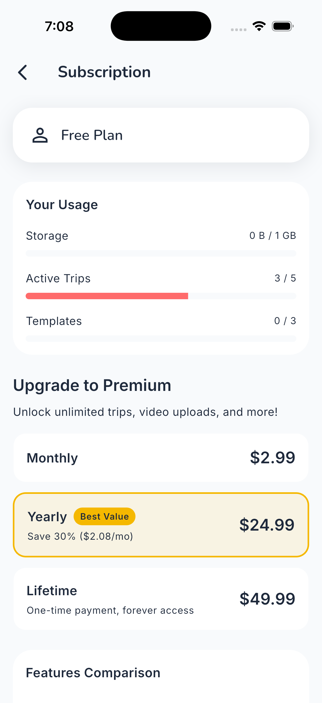

# In-app purchases

Everything needed to create Odyssey's products in App Store Connect and Google Play,
taken from the code rather than from memory. If you change a price or an id here,
change it in both places listed under *Where these live* or the app and the store will
disagree.

---

## The three products

| | Monthly | Yearly | Lifetime |
|---|---|---|---|
| **Product ID** | `odyssey_premium_monthly` | `odyssey_premium_yearly` | `odyssey_premium_lifetime` |
| **Reference Name** | Odyssey Premium Monthly | Odyssey Premium Yearly | Odyssey Premium Lifetime |
| **Display Name** | Monthly | Yearly | Lifetime |
| **Type** | Auto-Renewable Subscription | Auto-Renewable Subscription | Non-Consumable |
| **Price (USD)** | 2.99 | 24.99 | 49.99 |
| **Duration** | 1 month | 1 year | one-off, permanent |
| **Subscription Group** | Odyssey Premium | Odyssey Premium | n/a |
| **Rank in group** | 1 | 1 | n/a |

Product IDs are identical on both stores. They are the join between the app, the
receipt and the backend's `SubscriptionPlan`, so they cannot be renamed after release -
existing subscribers' receipts would stop matching.

Yearly is $24.99 against $35.88 for twelve months of Monthly: **30% off, $2.08/month**.
The app computes and shows that itself, so the store copy does not need to repeat it.

### Descriptions

App Store Connect wants a Display Name (max 30 chars) and a Description (max 45) per
product. Both are shown to users, and the form rejects anything longer - the counts
below are exact.

**Monthly** — `Odyssey Premium — Monthly`
> Unlimited trips, 25GB storage, no ads.

**Yearly** — `Odyssey Premium — Yearly`
> Save 30%. Unlimited trips, 25GB, no ads.

**Lifetime** — `Odyssey Premium — Lifetime`
> One payment. Premium for life, no renewals.

### Subscription group

Both subscriptions belong to one group, **Odyssey Premium**, at the same rank. Same
rank means they are a crossgrade: switching between Monthly and Yearly takes effect at
the next renewal rather than immediately, and a user can never hold both at once.

Lifetime sits outside the group because it is a Non-Consumable, not a subscription. It
never renews, never expires, and shows up in `Subscription.ExpiresAt` as `null`.

---

## What the money buys

Straight from `SubscriptionLimits.cs` on the backend. The paywall and the usage bars
read the same numbers, so this table is the product.

| | Free | Premium |
|---|---|---|
| Active trips | 5 | Unlimited |
| Activities per trip | 25 | Unlimited |
| Expenses per trip | 30 | Unlimited |
| Packing items per trip | 50 | Unlimited |
| Memories per trip | 10 | Unlimited |
| Media per memory | 5 | 20 |
| Documents per trip | 5 | Unlimited |
| Files per document | 3 | 10 |
| Templates | 3 | Unlimited |
| Storage | 1 GB | 25 GB |
| Max file size | 25 MB | 100 MB |
| Video uploads | — | Yes |
| Shared editing | — | Yes |
| Public templates | — | Yes |
| World map | — | Yes |
| Year in Review | — | Yes |
| Full statistics | — | Yes |
| Leaderboard | — | Yes |
| All achievements | — | Yes |
| Data export | — | Yes |
| Ads | Yes | None |

---

## Setting them up in App Store Connect

1. **Agreements first.** Paid Applications agreement active, with banking and tax
   filled in. Products cannot go live without it, and the app will simply return no
   products - a silent failure that looks like a bug.
2. **Subscription group.** Monetization → Subscriptions → create group
   **Odyssey Premium**. The group's own display name is what users see in Manage
   Subscriptions, so name it for a person, not a database.
3. **Add both subscriptions** with the ids, durations and prices above, both at rank 1.
4. **Add the Lifetime** under Monetization → In-App Purchases as a **Non-Consumable**.
5. **Per product**: Display Name, Description, and a **Review Screenshot** - a capture
   of the paywall showing that product. Missing screenshots are the usual reason a
   product sits in "Missing Metadata".
6. **Localizations**: at minimum the primary language. Products stay in Missing
   Metadata without one.
7. **Submit with the app build.** First-time IAPs are reviewed alongside the binary,
   not before it.

### App Review notes worth adding

Reviewers need to reach the paywall. Tell them: Settings → Subscription, or any
premium-gated feature (World Map, Year in Review). Give them a demo account that is
**not** already Premium, or the paywall will not show.

---

## Testing

**Simulator, no App Store Connect needed** - `ios/Odyssey.storekit`, run from Xcode.
Covers the paywall, product loading and the purchase sheet, but **premium never
activates**: the backend rejects locally-signed transactions on purpose. See
`storekit_testing.md`.

**Sandbox** - a sandbox tester on a physical device, against a backend set to
`APPLE_ENVIRONMENT=Sandbox`. This is the only way to test the grant end to end.
Do not point a sandbox tester at production: it is set to `Production` and will reject
the transaction, which is the check that stops a free sandbox account from being
granted real premium.

---

## Where these live

Change a product id or price and all of these have to agree:

| What | Where |
|---|---|
| Product IDs | `lib/src/features/subscription/data/constants/billing_config.dart` (`ProductIds`) |
| Fallback prices | same file (`BillingConfig.pricing`) |
| StoreKit test config | `ios/Odyssey.storekit` |
| Backend prices | `src/Odyssey.Application/Common/SubscriptionLimits.cs` |
| Backend plan mapping | `BillingConfig.getPlanFromProductId` (client) → `SubscriptionPlan` (server) |
| Tier limits | `SubscriptionLimits.cs` - the paywall reads these from the API |

The fallback prices exist for when the store is unreachable. They are a display
fallback only; the store's own price is always authoritative when it loads.
